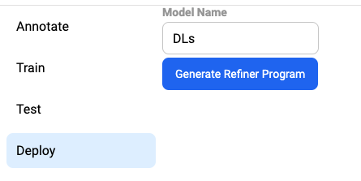

# Publishing

Purpose: Better allow for quick iteration of model training code, while keeping multiple Instabase environments -
especially sandboxes - up to date.

- It is impractical to manually update every single sandbox that uses the training code. We will inevitably miss
  updating one of these since there are so many, and so we need to update these environments consistently and with
  little effort

## How it works

Code from `ibformers` is zipped and pushed to each environment in `environments.yaml`, along with
the `metadata/package.json`. We then call an endpoint on each environment to publish the code as a marketplace package.

## Usage

- Add Instabase environments where you want the package published to `environment.yaml`
- From the repository root, run `python -m ci.publish`. The package in `ibformers` will be published to all environments
  where the current version as specified in (`ibformers/package.json`) is not already present

## environments.yaml

```yaml
dogfood:
  host: https://dogfood.instabase.com
  path: daniel.cahn/my-repo/fs/Instabase Drive/test_location # This is a root location used for test files. It should be a safe location where things can be saved and deleted
  token: SOME_TOKEN # TODO we should ideally use environment variables here

```

# Model Testing

Purpose: Better allow for quick iteration of model training code, while ensuring stability. We’re trying to prevent the
following user stories:

- I pushed a change to model training code, and now model training (given hyperparams and a dataset that worked before)
  no longer works, e.g. due to buggy code or because model accuracy falls significantly
- I pushed a change to the monorepo and now model training and/or model inference is failing

## How it works

### Training:

- Code from ibformers is zipped and pushed to each environment in environments.yaml, just like for publishing.
- We start a model training job with the config from the `model_tests.yaml` for the requested test if `--test testname`
  is specified or all tests otherwise
- We poll regularly (every `POLlING_INTERVAL = 10 seconds`) for an updated status on the job.
- If the job takes longer than the time limit, or if an error message is sent in a status update, we fail fast.
- At the end of training, metrics are received through a status update and are compared with the minimum requirements
  specified in the test's `metrics` field from `model_tests.yaml`. If the metrics are not high enough, we fail fast.
- The model created during training is saved to the filesystem, along with predictions on the test set

### Inference:

- We generate a Refiner program using the endpoint corresponding with the "Generate Refiner Program" button in
  Annotator 
- We call the Refiner program on the first document for which predictions were generated during model training
- When the results are received, we compare them with the inference predictions from training time and ensure they're
  the same

## Usage

Add tests to `model_tests.yaml`.

Run tests with `python -m ci.run_tests`. May take a while to run.

## model_tests.yaml

Example test config

```yaml
TestName:
  env: dogfood
  # The .ibannotator file specified should be accessible using the API key in environments.yaml
  ibannotator: ib_annotation/data/fs/Prod Drive/datasets/Something.ibannotator
  time_limit: 1200 # 1200 seconds = 20 minutes
  config:
    batch_size: 2
    learning_rate: 5.e-5 # Make sure to keep the . to make sure the yaml knows this is a float, not a string
    use_mixed_precision: true
    upload: false # Unless you need the weights downloaded after training, always include this
    use_gpu: true # Generally always true
    # Anything missing will use defaults on the server. Note that if defaults change, the results may change too.
  metrics: # all metrics currently assuming higher is better
    # Current metrics supported are "exact_match", "precision", "recall", "f1"
    exact_match:
      DL Number: 0.9
      Name: 0.3
      Address: 0.9
    precision:
      DL Number: 0.9 # Note that not all fields must be specified for every metric
    # Note that not all metrics must be tested
```

# Unpublish

```bash
python -m ci.unpublish --package ibformers --version 0.0.7
```

# Advanced

If something goes wrong, change the log-level on line 51 of `config.py` to debug.

# TODO: Add about Refiner stuff